# Nesne Yönelimli Programlama (OOP)

Nesne Yönelimli Programlama, kodu yapılandırmanın ve organize etmenin bir yolu olarak nesne kavramını kullanan bir programlama paradigmasıdır. Geliştiricilerin daha esnek, yeniden kullanılabilir ve sürdürülebilir yazılımlar oluşturmasını sağlayan soyutlama (abstraction), kapsülleme (encapsulation), kalıtım (inheritance) ve çokbiçimlilik (polymorphism) ilkelerine dayanır.

Aşağıda OOP ve dört ana kavramını dallar halinde gösteren bir grafik yer almaktadır. Her bir dal, ilişkilerini ve OOP paradigması içindeki önemlerini görselleştirmeye yardımcı olmak için ilgili kavramın kısa bir açıklamasına sahiptir.

 

---

 

## [Abstraction — Soyutlama](https://github.com/tanerceker/oop-ts/tree/main/oop-concepts/abstraction)

Soyutlama, programcıların gerçek dünyadaki varlıkları kodda nesneler olarak temsil etmelerine, karmaşıklıklarını gizlemelerine ve çözülen problemle ilgili temel özelliklere odaklanmalarına olanak tanır. Geliştiriciler soyutlamayı (abstraction) kullanarak karmaşık sistemlerin basitleştirilmiş modellerini oluşturabilirler.
 
 

## [Encapsulation — Kapsülleme](https://github.com/tanerceker/oop-ts/tree/main/oop-concepts/encapsulation)

Kapsülleme, verileri (öznitelikleri) ve işlemleri (yöntemleri) sınıf adı verilen tek bir birim içinde bir araya getirme mekanizmasıdır. Bu ilke, her nesnenin kendi durumunu ve davranışını yönetmesine ve dahili verilerine (internal data) erişimi kısıtlamasına izin vererek endişelerin ayrılmasına (separation of concerns) yardımcı olur.
 
 

## [Polymorphism — Çokbiçimlilik](https://github.com/tanerceker/oop-ts/tree/main/oop-concepts/polymorphism)

Çokbiçimlilik, tek bir arayüzün (interface) farklı nesne türlerini temsil etmesini sağlar. Bu, farklı sınıflardaki nesnelerin ortak bir üst sınıfın nesneleri olarak ele alınmasını sağlayarak aynı kodun farklı veri türleriyle çalışmasına olanak tanır. Çokbiçimlilik kod bakımını basitleştirir ve geliştiricilerin daha esnek ve genişletilebilir sistemler oluşturmasını sağlar.
 
 

## [Inheritance — Kalıtım](https://github.com/tanerceker/oop-ts/tree/main/oop-concepts/inheritance)

Kalıtım, mevcut sınıflardan öznitelikleri (attributes) ve yöntemleri (methods) devralan yeni sınıfların oluşturulmasını sağlar. Alt sınıf (Subclasses) olarak adlandırılan yeni sınıflar, ana sınıfın (temel (base) veya üst sınıf (superclass) olarak da bilinir) davranışını genişletebilir (extend) veya geçersiz kılabilir (override). Bu, ortak işlevler ilgili sınıflar arasında paylaşılabildiğinden kodun yeniden kullanılabilirliğini ve modülerliği teşvik eder.

 
 

---

 

OOP kavramlarını gösteren basit bir UML diyagramı:

 

 

**Not:** + public, - private, # protected olduğunu göstermektedir.
 
 
Nesne yönelimli programlama birçok modern programlama dilinde popülerdir. Geliştiriciler, OOP ilkelerini kullanarak sağlam ve ölçeklenebilir uygulamalar oluşturabilir ve bu da onu yazılım geliştirme dünyasında önemli bir paradigma haline getirir.

---

— Taner Çeker tarafından hazırlanmıştır.
