<br/>

# Abstraction — Soyutlama

Nesne Yönelimli Programlamada (OOP) soyutlama, karmaşık sistemleri daha küçük, daha yönetilebilir bileşenlere ayırarak basitleştirme sürecini ifade eder.

Bir sistemin uygulama detaylarının gizlenmesini ve kullanıcıya yalnızca temel özelliklerin gösterilmesini içerir. Soyutlama, geliştiricilerin altta yatan karmaşıklıkla ilgilenmeden bir bileşenin temel işlevselliğine odaklanmasına olanak tanıyarak kodun anlaşılmasını, sürdürülmesini ve genişletilmesini kolaylaştırır.

<br/>

---

<br/>

## Typescript'te Soyutlama

Typescript'te soyutlama, sınıflar ve arayüzler aracılığıyla gerçekleştirilir. Sınıflar, nesneler oluşturmak için planlar tanımlamanıza olanak sağlarken, arayüzler bir sınıfın uyması gereken sözleşmeyi (contract) tanımlar. Arayüzler, gerekli özelliklere (properties) ve yöntemlere (methods) sahip olmalarını sağlayarak sınıflar üzerinde belirli bir yapıyı zorlamak için kullanılır.

Basit bir soyutlama (abstraction) örneği:

```tsx
// Bir şekil için arayüz tanımlayın
interface Shape {
  area(): number;
  perimeter(): number;
}

// Shape arayüzünü bir Circle sınıfı ile uygulayın
class Circle implements Shape {
  constructor(private radius: number) {}

  area(): number {
    return Math.PI * this.radius * this.radius;
  }

  perimeter(): number {
    return 2 * Math.PI * this.radius;
  }
}

// Shape arayüzünü bir Rectangle sınıfına uygulayın
class Rectangle implements Shape {
  constructor(private width: number, private height: number) {}

  area(): number {
    return this.width * this.height;
  }

  perimeter(): number {
    return 2 * (this.width + this.height);
  }
}

// Bir dizi şeklin toplam alanını hesaplayan fonksiyon
function calculateTotalArea(shapes: Shape[]): number {
  const totalArea = shapes.reduce((acc, shape) => acc + shape.area(), 0);
  return totalArea;
}

// Circle ve Rectangle örneklerini oluşturun
const circle = new Circle(5);
const rectangle = new Rectangle(4, 6);

// Şekil dizisini kullanarak toplam alanı hesaplayın
const shapes: Shape[] = [circle, rectangle];
console.log("Total area:", calculateTotalArea(shapes));
// Output: Total area: 102.53981633974483
```

Bu örnekte, iki yöntem içeren bir Shape arayüzü tanımlıyoruz: area() ve perimeter(). Daha sonra Shape arayüzünü uygulayan Circle ve Rectangle adında iki sınıf oluşturuyoruz. Bu, her iki sınıfın da area() ve perimeter() yöntemlerine sahip olmasını zorunlu kılar ve bir soyutlama düzeyi sağlar. calculateTotalArea() fonksiyonu bir dizi Shape nesnesini kabul eder ve toplam alanı hesaplayıp farklı şekil türleriyle tutarlı ve basitleştirilmiş bir şekilde çalışarak soyutlamanın faydalarını gösterir.

<br/>

---

<br/>

## Date sınıfı örneği

Date sınıfı, tarih ve saatlerle çalışmak için bir soyutlama sağlar. Tarih ve saat hesaplamalarının karmaşıklığını kapsüllerken (encapsulate), geliştiricilerin tarih ve saat bilgilerini manipüle etmesi ve alması için basit ve sezgisel bir API sağlar.

Date sınıfı artık yıllar, saat dilimleri, yaz saati uygulaması ve tarih ve saat değerlerinin gerçek dahili gösterimi gibi detayları gizler. Geliştiriciler, bu karmaşıklıklar hakkında endişelenmek zorunda kalmadan tarih ve saatleri oluşturmak, ayrıştırmak, karşılaştırmak ve değiştirmek için sağlanan yöntemleri kullanabilir.

Date sınıfının soyutlamayı (abstraction) nasıl kullandığını gösteren bir örnek:

```tsx
// Geçerli tarih ve saati alın
const now = new Date();

// Geçerli yılı, ayı ve tarihi alın
const currentYear = now.getFullYear();
const currentMonth = now.getMonth() + 1; // Ay sıfır tabanlıdır, bu nedenle 1 ekleriz
const currentDate = now.getDate();

console.log(`Today is ${currentYear}-${currentMonth}-${currentDate}`);

// Belirli bir tarihe (örneğin, Noel) kadar olan gün sayısını hesaplayın
const christmas = new Date(currentYear, 11, 25); // Ay sıfır tabanlıdır, yani Aralık 11'dir
const millisecondsPerDay = 24 * 60 * 60 * 1000;
const daysUntilChristmas = Math.ceil((christmas - now) / millisecondsPerDay);

console.log(`There are ${daysUntilChristmas} days until Christmas`);

// Yerleşik toLocaleDateString yöntemini kullanarak geçerli tarihi biçimlendirin
const formattedDate = now.toLocaleDateString("en-US", {
  weekday: "long",
  year: "numeric",
  month: "long",
  day: "numeric",
});

console.log(`Today is ${formattedDate}`);
// Output: Today is Monday, October 16, 2023
```

Bu örnekte, geçerli tarih ve saati elde etmek, yılı, ayı ve tarihi çıkarmak, Noel'e kadar olan gün sayısını hesaplamak ve geçerli tarihi belirli bir yerel ayara göre biçimlendirmek için Date sınıfını kullanıyoruz. Date sınıfı, tarih ve saat hesaplamalarının altında yatan karmaşıklığı soyutlarken bu görevleri gerçekleştirmek için basit bir API sağlar.

<br/>

---

<br/>

## Bir Soyutlama Örneği Olarak TypeORM

TypeORM, geliştiricilerin birleşik, üst düzey bir API kullanarak farklı veritabanı türleriyle etkileşime girmesine olanak tanıyan, çeşitli veritabanları üzerinde bir soyutlama katmanıdır. Bu soyutlama katmanı (abstraction layer), veritabanına özgü SQL sorguları yazma ihtiyacını azaltır ve veri kalıcılığı ile başa çıkmak için daha Javascript/Typescript dostu bir yol sağlar.

<br/>



<br/>

TypeORM'un özellikle bir şema tanımlama, veritabanını sorgulama ve bir tabloya girdi ekleme söz konusu olduğunda nasıl bir soyutlama katmanı görevi gördüğünü inceleyelim.

<br/>

### 1. Bir Şema Tanımlama

TypeORM'da, varlıklar (entities) oluşturarak bir şema (schema) tanımlarsınız. Bir varlık (entity), bir veritabanı tablosuna eşlenen bir sınıftır. Varlığın her bir örneği tablodaki bir satırı temsil eder. İşte bir örnek:

```tsx
import { Entity, PrimaryGeneratedColumn, Column } from "typeorm";

@Entity()
export class User {
  @PrimaryGeneratedColumn()
  id: number;

  @Column()
  firstName: string;

  @Column()
  lastName: string;

  @Column()
  age: number;
}
```

Bu örnekte, bir User sınıfı veritabanındaki bir User tablosuna eşlenir. User sınıfının her özelliği (property) tablodaki bir sütunla eşlenir. Eşlemeyi bildirmek için @Entity, @PrimaryGeneratedColumn ve @Column dekoratörleri (decorators) kullanılır.

<br/>

### 2. Veritabanı Sorgulama

TypeORM, veritabanından veri almak için bir depo (repository) API sağlar. Bu, TypeScript ve JavaScript'e daha yakın bir şekilde sorgular (queries) yazmanıza olanak tanır. İşte bir örnek:

```tsx
import { getRepository } from "typeorm";
import { User } from "./User";

async function getUser() {
  const userRepository = getRepository(User);
  const user = await userRepository.findOne({ id: 1 });
  console.log(user);
}
```

Bu örnekte, getRepository(User) size User varlığı (entity) için bir depo (repository) sağlar.
Depo (Repository), veritabanını sorgulamanıza (query) olanak tanıyan findOne, find, save gibi yöntemlere (methods) sahiptir. findOne yöntemi, id'si 1 olan tek bir kullanıcıyı (user) getirir.

<br/>

### 3. Tabloya Girdi Ekleme

Bir tabloya veri eklemek, varlığın (entity) bir örneğini (instance) oluşturmayı ve ardından depoyu (repository) kullanarak kaydetmeyi içerir. İşte bir örnek:

```tsx
import { getRepository } from "typeorm";
import { User } from "./User";

async function createUser() {
  let user = new User();
  user.firstName = "John";
  user.lastName = "Doe";
  user.age = 25;

  const userRepository = getRepository(User);
  await userRepository.save(user);
  console.log("User has been saved.");
}
```

Bu örnekte, yeni bir User örneği (instance) oluşturuyor ve ardından User deposunun (repository) save yöntemini (method) kullanarak kaydediyoruz. Save yöntemi hem ekleme (insert) hem de güncelleme (update) işlemlerini gerçekleştirir. User örneği (instance) veritabanında mevcut değilse, eklenecektir. Eğer varsa, güncellenecektir.

TypeORM, veritabanı üzerinde bir soyutlama katmanı (abstraction layer) sağlayarak veritabanıyla daha Javascript/Typescript dostu bir şekilde çalışmanıza olanak tanır. Temel CRUD işlemleri için ham SQL sorguları yazma ihtiyacını ortadan kaldırır ve veritabanıyla çalışmanın daha nesne yönelimli bir yolunu sağlar.
