<br/>

# Inheritance — Kalıtım

Kalıtım, Nesne Yönelimli Programlamada (OOP) bir sınıfın başka bir sınıftan özellikleri (properties) (öznitelikleri) ve yöntemleri (methods) (fonksiyonları) miras almasını sağlayan ve böylece kodun yeniden kullanılabilirliğini ve modülerliğini teşvik eden temel bir kavramdır.

<br/>

---

<br/>

## Typescript'te Kalıtım

Kalıtım, mevcut bir sınıftan (temel sınıf (base class)) yeni bir sınıf (türetilmiş sınıf (derived class)) oluştururken mevcut sınıfın davranışını korumaya ve yeni işlevler eklemek için onu genişletmeye (extending) veya geçersiz kılmaya (overriding) yardımcı olur. Typescript'te kalıtım, extends anahtar sözcüğü kullanılarak uygulanır.

Typescript'te kalıtımı (inheritance) göstermek için bir örnek:

```tsx
// Temel (Base) sınıf: Animal
class Animal {
  protected name: string;

  constructor(name: string) {
    this.name = name;
  }

  move(distance: number = 0) {
    console.log(`${this.name} moved ${distance} meters.`);
  }
}

// Türetilmiş (Derived) sınıf: Animal'dan kalıtım alan Dog
class Dog extends Animal {
  constructor(name: string) {
    // Temel sınıfın yapıcısını çağırır
    super(name);
  }

  bark() {
    console.log("Woof! Woof!");
  }

  // Animal sınıfından move yöntemini geçersiz kılar
  move(distance: number = 5) {
    console.log("The dog is running...");
    // Temel sınıfın move yöntemini çağırır
    super.move(distance);
  }
}

const myDog = new Dog("Max");

myDog.bark();
// Output: Woof! Woof!

myDog.move();
// Output: The dog is running...
//         Max moved 5 meters.
```

Bu örnekte, bir name özniteliği (attribute), bir yapıcısı (constructor) ve bir move yöntemi (method) olan bir temel sınıfımız (base class) Animal vardır. Daha sonra extends anahtar sözcüğünü kullanarak Animal sınıfından miras alan türetilmiş (derived) bir Dog sınıfı oluşturuyoruz. Dog sınıfının kendi bark yöntemi vardır ve Animal sınıfındaki move yöntemini geçersiz kılar (override). Yeni bir Dog örneği (instance) oluştururken, hem Dog sınıfındaki bark yöntemini hem de Animal sınıfındaki move yöntemini (geçersiz kılınmış (overridden) davranış ile) kullanabiliriz.

<br/>

---

<br/>

## Gerçek Dünya Örneği

TypeScript kalıtımının (inheritance) kullanılabileceği bir e-ticaret uygulamasını içeren gerçekçi bir senaryoya göz atalım.

<br/>



<br/>

Bu diyagramda üç sınıfımız var: Product, Book ve Electronic. Hem Book hem de Electronic sınıfları --|> sembolü ile Product sınıfından miras alınmış olarak gösterilmiştir. Sınıf alanları (fields) ve yöntemleri (methods) de ana hatlarıyla belirtilmiştir. Alan adları (Field names) ve yöntem adlarından (method names) önceki + sembolü bunların public olduğunu gösterir.

```tsx
// Tüm ürünler için ortak özellikleri tanımlayan temel (base) sınıf Product
class Product {
  constructor(
    public id: string,
    public price: number,
    public description: string
  ) {}

  display(): void {
    console.log(
      `ID: ${this.id}, Price: ${this.price}, Description: ${this.description}`
    );
  }
}

// Product temel (base) sınıfını genişleten türetilmiş (derived) bir sınıf Book
class Book extends Product {
  constructor(
    id: string,
    price: number,
    description: string,
    public author: string,
    public title: string
  ) {
    // Temel sınıfın yapıcısını çağırır
    super(id, price, description);
  }

  display(): void {
    // Temel sınıftaki display yöntemini çağırır
    super.display();
    console.log(`Author: ${this.author}, Title: ${this.title}`);
  }
}

// Product temel (base) sınıfını genişleten türetilmiş (derived) bir Electronic sınıfı
class Electronic extends Product {
  constructor(
    id: string,
    price: number,
    description: string,
    public brand: string,
    public model: string
  ) {
    // Temel sınıfın yapıcısını çağırır
    super(id, price, description);
  }

  display(): void {
    // Temel sınıftaki display yöntemini çağırır
    super.display();
    console.log(`Brand: ${this.brand}, Model: ${this.model}`);
  }
}

let book = new Book("1", 19.99, "A great book", "John Doe", "My Great Book");
book.display();

let electronic = new Electronic(
  "2",
  299.99,
  "A great laptop",
  "Dell",
  "XPS 15"
);

electronic.display();
```

Bu örnekte, çeşitli ürün türlerini sattığımız bir e-ticaret uygulamamız var. ID, price, description ve bu bilgileri görüntülemek için bir yöntem gibi tüm ürünlerde ortak olan özellikleri ve yöntemleri içeren temel bir Product sınıfıyla başlıyoruz.

Daha sonra, her ikisi de Product sınıfından miras alan bir Book sınıfı ve bir Electronic sınıfı tanımlarız. Bu sınıfların her biri kendi türüne özgü ek özelliklere sahiptir (Kitap için author ve title, Elektronik için brand ve model gibi) ve kendi özelliklerini içerecek şekilde display yöntemini geçersiz kılarlar.

Bu örnek, bir temel sınıfta (base class) ortak özellikler ve yöntemler tanımlayarak ve bu temel sınıfı her bir ürün türü için genişleterek (extending) daha düzenli ve bakımı kolay bir kod tabanı oluşturmak için Typescript kalıtımının (inheritance) nasıl kullanılabileceğini göstermektedir.
